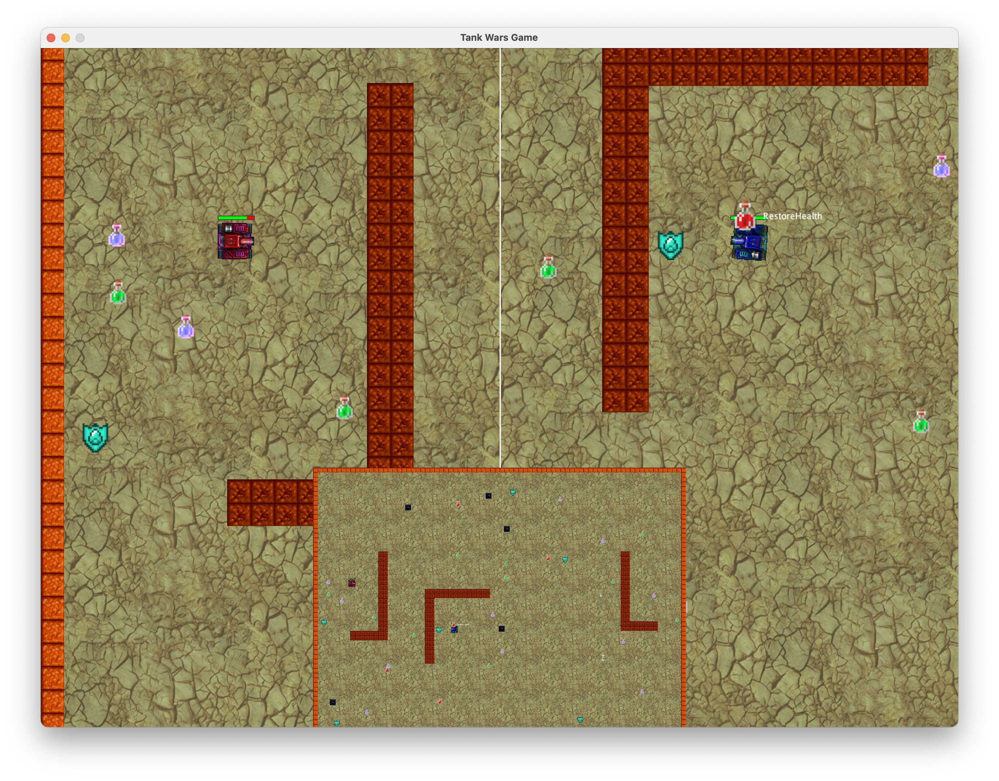

# Term Project Documentation

**Joshua Garcia**

## Introduction

The Tank Wars project focuses on implementing a 2D game in Java. The primary objective is to practice and demonstrate good Object-Oriented Programming (OOP) principles. This documentation outlines the project overview, the general idea of the Tank Wars game, and provides a detailed explanation of the design and implementation choices made throughout the project. The project aims to create a fully functional 2D tank game using Java, adhering to OOP principles such as encapsulation, inheritance, polymorphism, and abstraction.

## Development Environment

- **IDE**: IntelliJ IDEA 2024.1.2
- **Java Version**: 17 openjdk-17.0.2
- **Libraries**: No special libraries used

### How to Build or Import the Game in the IDE

To run the game:

1. Open a terminal in the JAR folder and run: `java -jar ./tank.jar`
   - No need to use IntelliJ.

To build the game using IntelliJ:

1. Open the root folder in IntelliJ and set up the required Java version (Java 17 corretto).
2. Locate and mark the resource folder as the **RESOURCES** root.
3. Navigate to **Project Structure** settings and select **Artifacts** under **Project Settings**. Then choose **JAR** and “From modules with dependencies”.
4. Select `tankgame.Launcher` as the Main Class, apply, and build the artifacts.
5. Run the game using `java -jar ./tank.jar`.

## Assumptions Made When Designing and Implementing the Game

- The game is designed for two players.
- Players are assumed to have the means to play the game.

## Class Descriptions

### Power-Up Related Classes

- **IncreaseShootingSpeed**: Increases a tank's shooting speed.
- **IncreaseSpeed**: Increases a tank's movement speed.
- **PesoPluma**: Enhances a tank with increased speed, bullet damage, and shield, while resetting other power-ups and changing background music.
- **RestoreHealth**: Restores a tank's health to default lives.
- **Shield**: Activates a tank's shield.
- **PowerUpFactory**: Creates instances of random power-ups.
- **PowerUp**: Template for power-ups, managing their effects and duration.

### Game Object Related Classes/Interfaces

- **BreakableWall**: Manages behavior for a breakable wall that interacts with power-ups.
- **Wall**: Manages behavior for an indestructible wall.
- **Bullet**: Manages behavior of a bullet, including collision detection and drawing.
- **Tank**: Manages behavior of a tank, including collision detection and drawing.
- **TankControl**: Handles key events to control tank movements and actions.
- **GameObject**: Generic game object with properties required to interact with the game, serving as a base class.

### Game Object Related Interfaces

- **Colliable**: Blueprint for handling collisions.
- **Updatable**: Blueprint for updating the state.
- **Poolable**: Blueprint for managing state updates.

### Game World Related Classes

- **GameWorld**: Manages game objects, rendering, and updating the game world.
- **GameState**: Manages the current state of the game.
- **GameConstants**: Centralizes important values for easy management.
- **StartMenuPanel**: Represents the game's start menu.
- **EndGamePanel**: Displays the end game message and provides restart options.

### Game Resource Management Related Classes

- **ResourceManager**: Manages game assets.
- **Sound**: Manages sound playback.
- **SoundManager**: Manages background music.
- **ResourcePool**: Manages reusable game objects.
- **ResourcePools**: Manages `ResourcePool` instances.

## Program Entry Point

- **Launcher**: Initializes and manages the main user interface, including start menu, game panel, end menu, and transitions.
